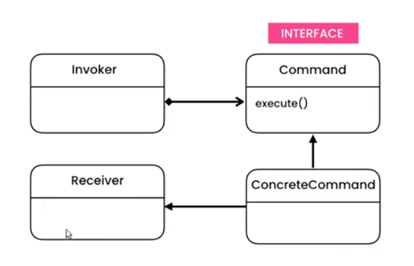
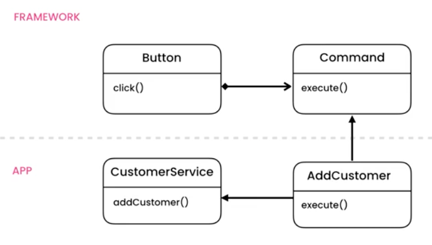

# Command Pattern - 1. Adding customer. 2. Bolding content and undo command

The command pattern breaks out each command into a class with 1 or 2 small methods, execute() and undo(). These methods will be passed down as dependencies to e.g a button class. 

```ts
public class Button {
  private command: Command;

  constructor(command: Command) {
    this.command = command;
  }

  public click(): void {
    this.command.execute();
  }
}

public class CustomerService {
  public addCustomer(): void {
    console.log("Add customer");
  }
}

public class AddCustomerCommand implements Command {
  private service: CustomerService;

  constructor(service: CustomerService) {
    this.service = service;
  }

  public execute(): void {
    this.service.addCustomer();
  }
}

const service = new CustomerService()
const command = new AddCustomerCommand(service)
const button = new Button(command)
button.click() // prints Add customer
```

## UML

Original example



Implementation of Example 1



## Problem and Solution

For instance, a button with a click method might behave different on various places in the application. E.g click on one button might save a document while click on another might save a customer to the database. 

The solution is to separate the execution of click from the button to it's own class.  

## Implementation

This application has two examples 

***Example 1*** To add a customer by passing in a service and a command to the button. 

***Example 2*** 
1. Add content to a document 
2. To bold the content with the BoldCommand
3. Undo the BoldCommand from History with the UndoCommand
4. Print out the new state. 
