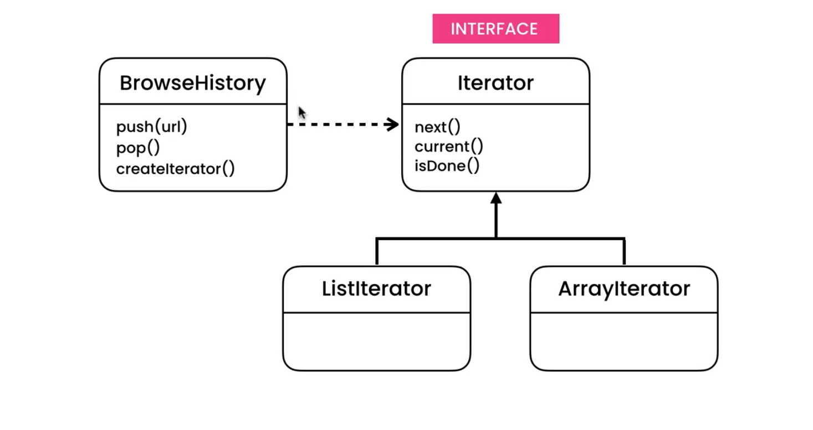

# Iterator Pattern - Iteration through history of URLs

## UML



## Implementation

This example demonstrates the single responsibility principle by separating the BrowserHistory and Iteration class. We keep the code less error prone by instantiating the iterator outside of the class (in this case in main.js). Now internal history code can be changed without breaking other parts of the code.

```ts
    // history.ts
    public createIterator(): Iterator<string> {
        return new this.ArrayIterator(this);
    }
```

With a nested class

```ts
    // history.ts
    public ArrayIterator = class implements Iterator<string> {
```

```ts
// main.ts
const iterator: Iterator<string> = history.createIterator();

while (iterator.hasNext()) {
  const url = iterator.current();
  console.log(url);
  iterator.next();
}
```
