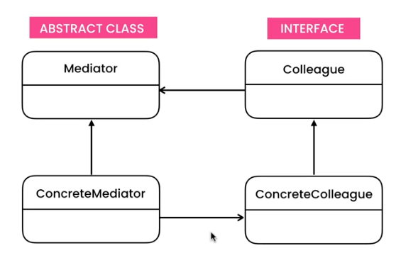
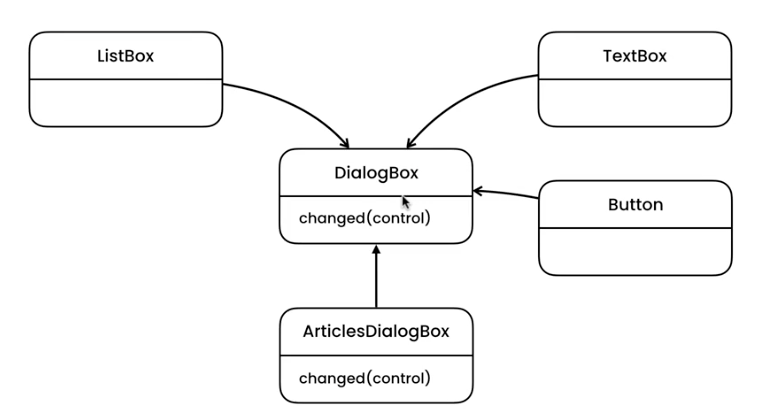
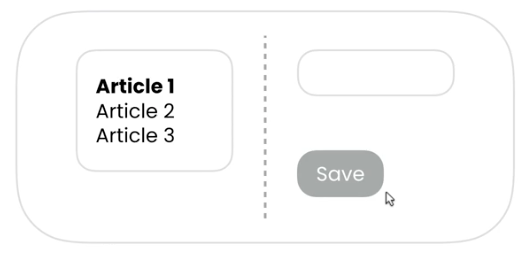

# Mediator Pattern - Delegate actions on GUI control change.

Definition: Mediator - a person who attempts to make people involved in a conflict come to an agreement; a go-between person.

## UML

Gang of 4 



Implementation 




## Implementation

This implementation demonstrates how different GUI controls can communicate with each other. 

We have a list of articles where we can change the title. 
- Save button will change between disabled/enabled depending on if the textBox has a value or not. 
- The list of articles will update when the save button have been clicked. 



The key in this pattern is to have one class (DialogBox/Mediator in UML:s above) that binds all events and executing related actions. 

NOTE. This is also using the observer pattern aka EventHandler()

```ts
export class DialogBox {
  private articlesListBox: ListBox = new ListBox();
  private titleTextBox: TextBox = new TextBox();
  private saveButton: Button = new Button();

  constructor() {
    const self = this

    // Wraps an anonymous class with handler method 
    const articleSelectedHandler = new class implements EventHandler {
      public handle(): void {
        self.articleSelected()
      }
    }

    // Wraps an anonymous class with handler method 
    const titleChangedHandler = new class implements EventHandler {
      public handle(): void {
        self.titleChanged()
      }
    }

    // Listens to article selected
    this.articlesListBox.addEventHandler(articleSelectedHandler);
    
    // Listens to title selected
    this.titleTextBox.addEventHandler(titleChangedHandler);
  }

    /** Toggles button enable/disable state based on the value in TextBox */
  private titleChanged(): void {
    var content = this.titleTextBox.getContent();
    var isEmpty = (content == null || !!content);
    this.saveButton.setEnabled(!isEmpty);
  }

    /** Sets the value in the title TextBox and enables save button */
  private articleSelected(): void {
    this.titleTextBox.setContent(this.articlesListBox.getSelection());
    this.saveButton.setEnabled(true);
  }
}

```

 