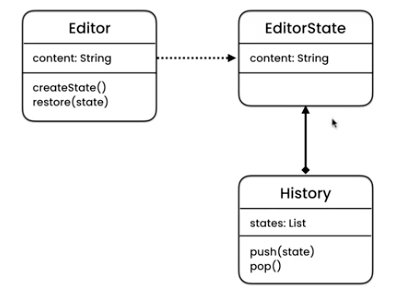

# Memento - Undo feature for an editor or moving in history

## UML

## Implementation

This example demonstrates how an editor can save states in history to enable features like undo and moving in history.
