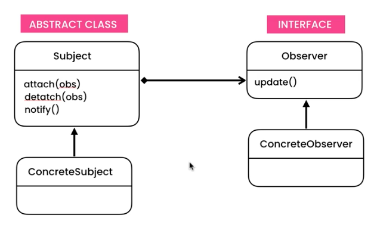
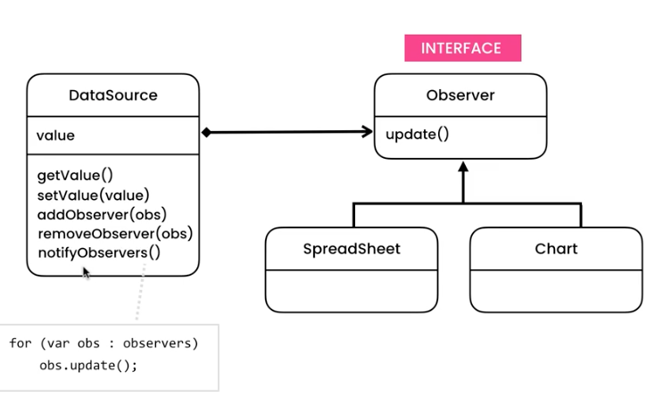
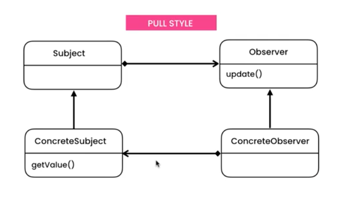
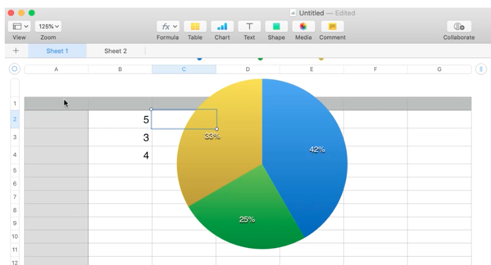
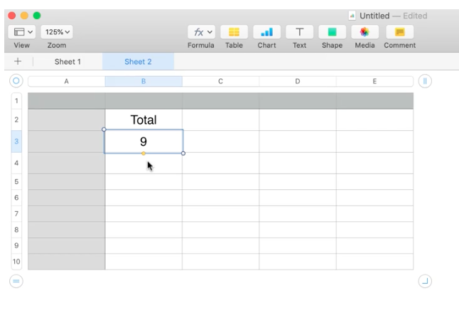

# Observer Pattern - Updating a graph based on values in spread sheet

## UML

Original Gang of 4 UML


Push style


Pull style



## Implementation

This implementation is an example of how to use the observer pattern in a spread sheet. When updating the values in one spreadsheet the subscribing chart will be notified about the change. 



Example of another spread sheet observing changes in the first spread sheet. 



The observable (a.k.a. subject) class 
- holds a list of observables
- has the ability to add (and remove) observers to the list
- has a method to notify each observer/subscriber about the update
```ts
public class Observable {
  private observers: Observer[] = [];

  public addObserver(observer: Observer): void {
    this.observers.push(observer);
  }

  public notifyObservers(value: number): void {
    this.observers.forEach((observer: Observer) => {
      observer.update()
    })
  }
}
```

Example of a class where observers can observe/(subscribe to changes)
```ts
public class DataSource extends Observable {
  private value!: number;

  public setValue(value: number): void {
    this.value = value;
    this.notifyObservers();
  }
}
```

An interface to enforce the update method to each observer
```ts
public interface Observer {
  update(value: number): void // This method will be called each time a value is changes. 
}
```

Example of a observer class listening for changes
```ts
public class Chart implements Observer {
  public update(value: number): void {
    console.log("Chart got notified");
  }
}
```

Execution
```ts
const dataSource = new DataSource()
const sheet1 = new SpreadSheet()
const chart = new Chart()

dataSource.addObserver(sheet1)
dataSource.addObserver(chart)

dataSource.setValue(1)

// Spread Sheet got notified
// Chart got notified
```

### Push and Pull style

The same example is made with 2 variations of styles, Push and Pull

### Push style

Push style passes the new value with the notification. 

The Observes update method receives the value
```ts
public class Chart implements Observer {
  public update(value: number): void {
    console.log("Chart got notified", value);
  }
}
```

```ts
public class Observable {
  
    // ...

    // Passing the value with the .update(value)
    public notifyObservers(value: number): void {
        this.observers.forEach((observer: Observer) => {
            observer.update(value)
        })
    }
}
```

```ts
export class DataSource extends Observable {
    // ...

    // The Observable class needs to pass the value with the .notifyObservers(value)
    public setValue(value: number): void {
        this.value = value;
        this.notifyObservers(value);
    }
}
```

### Pull style

Pull style only notifies it's observers about the change but not what the new value is. The new value has to be fetched by the observer.   

```ts
export class Chart implements Observer {
  private dataSource!: DataSource;
  
  // Is dependent on a dataSource to later fetch the value
  public constructor(dataSource: DataSource) {
    this.dataSource = dataSource;
  }

  public update(): void {
    console.log("Chart got updated: " + this.dataSource.getValue()); // Get the value from the dataSource
  }
}
```