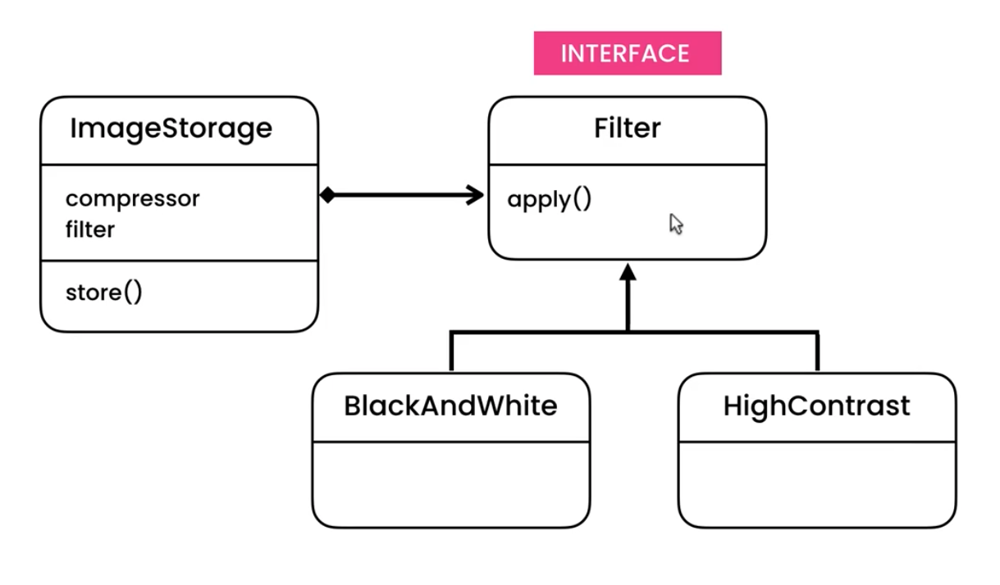
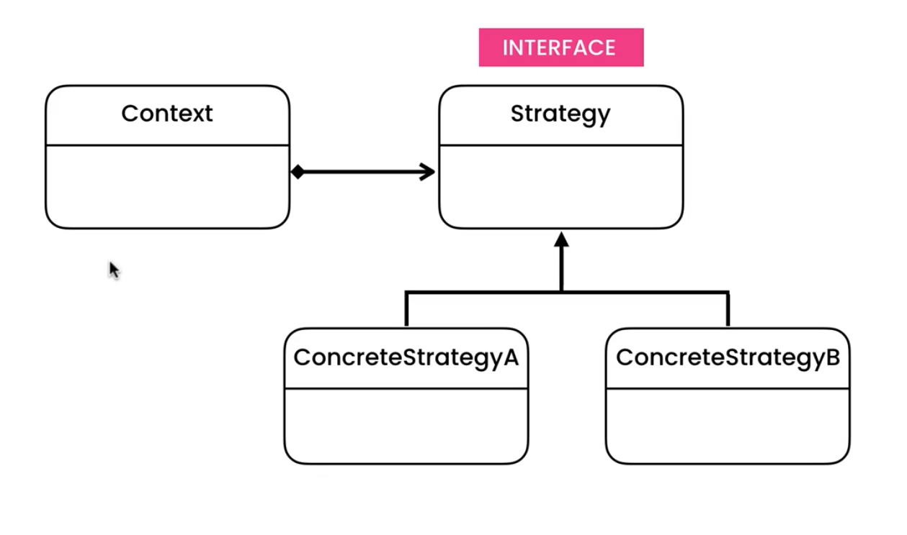
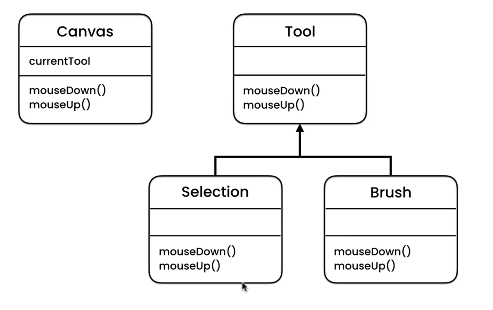

# Strategy Pattern - ImageStore with Filter and Compression

## UML

### Implementation

### Gang of 4

This pattern is using the polymorphism to change the behavior e.g

- for a **JPEG** image we'll use the **jpeg compressor**
- for a **PNG** image we'll use the **png compressor**

This pattern is very similar to the **_State Pattern_**. The only difference is that in the state pattern keeps the state. Consider PhotoShop, selecting a tool like the brush will change the behavior on mouseUp() and mouseDown(). This state will be remain until the user selects another tool.

In the **Strategy Pattern** there are no states. Polymorphism happens in real time.

## Implementation

This examples demonstrates how to implement a **_ImageStore_** with **_ImageFilter_** and a **_ImageCompression_**
