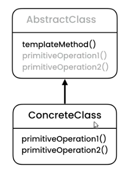
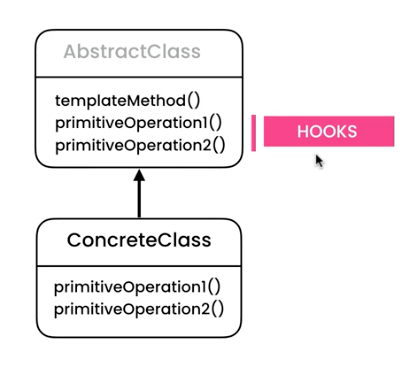

# Template - Transfer Money and Record Transaction and send Email

## UML

A Class extending an abstract class with abstract methods



A Class extending an abstract class with concrete methods



## Implementation

This example demonstrates how to force record a transaction every time a transaction is made. 

The magic here is in the AbstractClass called Task which has an public method execute(), this is the template for executing a Task/Transaction. For instance we can ensure to record the transaction before it get executed with doExecute(). 

```ts
// Task Class

// Template method
  public execute(): void {

    // Code to run before task is executed
    this.auditTrail.record();

    this.doExecute();

    // Code to run after task is executed
    this.email.send()
  }

// Implementation to be determine by subclass
protected abstract doExecute(): void;
```

```ts
// TransferMoneyTask Class
protected doExecute(): void {
    console.log("Transfer Money");
}
```

Example of Output
```
Audit
Transfer Money
Send Email
-------------
Audit
Generate Report
Send Email
```

The benefit of this implementation is that whenever some else is creating a new task the won't forget things like record or send email to the user when the new task gets executed, since this is defined in the template method. 

This code pattern is common in frameworks e.g validate data before saving to data base and adding record as a new version after record got saved. 